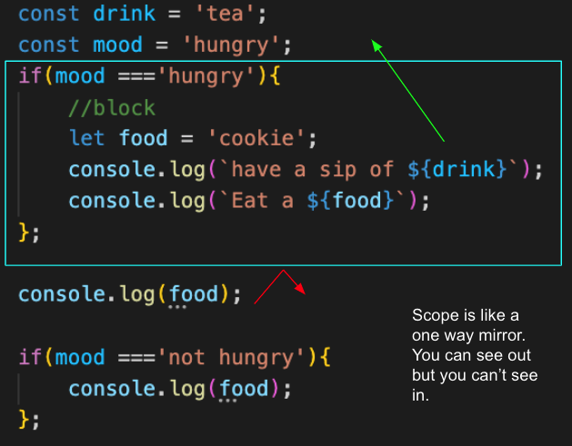

# JavaScript Data Types and Variables
## SWBAT
- Use console.log, debugger, and node to test and debug JavaScript
- Define all 7 JavaScript data types
- Implement JavaScript conditionals

### Debugging Tools
- Comments   
```
// Comments begin can with a double backslash. They are used to leave notes in the code that will be ignored when the program is executed. 
```
- Console.log
```   
// A method outputs a message to the web console
console.log('welcome to phase-1 JavaScript);

```

- Debugger 
```
// A statement that adds a breakpoint to your code. A breakpoint pauses your code in the middle of execution
debugger;

```
- Node
```
//Typing node in your terminal opens a REPL (Read-Eval-Print Loop). This allows you a small environment to test out tiny bits of code.

node
```

## JavaScript Types
#### Note: we can use typeof or typeof() to determine datatypes

- Strings 🧵
```
// Used for characters 

'welcome to SCF'
"welcome to SCF"
`welcome to SCF`
```
- Number 🔢
```
// Integers, Floats(Real numbers)
// The maximum safe integer in JavaScript (2^53 - 1).
// NaN(Not a number) has the datatype of number 😓 
42
42.01
Infinity
-Infinity
NaN
```

BigInt
```
// Numbers that are too large for number
Number.MAX_SAFE_INTEGER
// 9007199254740991
BigInt(9007199254740991)
// 9007199254740991n
```
Booleans ✅ 🚫
```
// Logic, true or false values 
true 
false

// Falsy values
!!0
//false
!!""
//false
!!null
//false
!!undefined 
//false
!!NaN
//false

// Truthy values 
!!{}
// true
!![]
// true
!!42
// true
!!"tiger rose"
//true
!!Infinity
!!true

```
Undefined 
```
//values assigned to variables that have been declared but not assigned a value
let a 
// undefined 

```
Null
```
// Represents an absence of a value
```
Symbols 
```
// These are Not emoji
//  Symbols are often used to add unique property keys to an object
// 


```

## Variables 
```
// Never use var
var dogCat = 'tiger rose'

// variables defined with const can't be reassigned 
const bestDogCat = 'tr'

// variables defined with lets can be reassigned 

let animal = 'tom'
animal = 'tiger rose'

```

## Conditionals 
```
// The if statement executes if a condition is truthy

if(true == true) {
    console.log('my dog is cute')
};

// if...else will execute the first block if the condition is true, else it will execute the second blog

if(dog == 'tr'){
    console.log('tr wins best dog contest!')
} else {
    console.log(`${dog} is a good dog`)
};

// else if can have multiple conditions

if(weather == 'sunny'){
    console.log('go for a walk')
} else if (weather == 'raining') {
    console.log('stay inside and read')
} else if (weather == 'snow') {
    console.log('make hot coco')
} else {
    console.log('¯\_(ツ)_/¯')
}


```

## Scope 
```
// the accessibility of the values and the variables 

// global: its accessible everywhere 
let teacher = 'shelby'

// local(function scope): only accessible within the function that its been defined in

function cuteCate(){
    let teacher = 'shelby'
}

// block scopes: only restricted within the block

if(true == true) {
    let teacher = 'shelby'
};


```



note: var ignores this scoping rule, which is why we avoid using it.